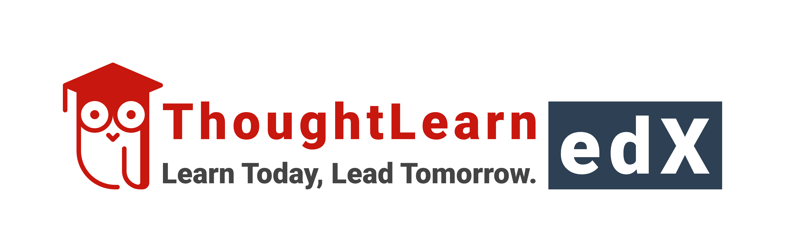

# Welcome to ThoughtLearn edX 🚀

  

---

## About Us

**ThoughtLearn edX** is an innovative organization dedicated to transforming education and professional training. We provide **Virtual Labs** and **Scenario-Based Training Solutions** tailored for **Educational Institutes** and **Corporate Companies**. Our mission is to bridge the gap between theoretical knowledge and practical skills, enabling learners to thrive in real-world environments.
 
- **Mission:** Empowering the next generation with hands-on, immersive learning experiences.  
- **Vision:** To redefine education and training through cutting-edge virtual solutions.

## What We Do

We specialize in delivering:  
- **Virtual Labs:** Interactive, cloud-based environments for experimentation and skill-building.  
- **Scenario-Based Training:** Real-world simulations to enhance problem-solving and decision-making skills.  
- **Custom Solutions:** Tailored programs for schools, universities, and businesses.  

Whether you're a student mastering complex concepts or a professional upskilling for the future, **ThoughtLearn edX** has you covered!

## Our Offerings

| **Target Audience**       | **Solutions**                       | **Benefits**                          |
|---------------------------|-------------------------------------|---------------------------------------|
| Educational Institutes    | Virtual STEM Labs, Course Modules  | Hands-on learning, scalable access   |
| Corporate Companies       | Workforce Training, Skill Sims     | Practical skills, measurable results |

## Why Choose ThoughtLearn edX?

- **Innovative Technology:** Built on robust platforms for seamless user experiences.  
- **Accessibility:** Learn anytime, anywhere with our cloud-based solutions.  
- **Real-World Focus:** Scenarios designed by industry experts to ensure relevance.  
- **Community-Driven:** We collaborate with educators and professionals to evolve our offerings.

## Get Involved

- **Explore Our Labs:** [Visit Our Website](https://thoughtlearn.com)  
- **Partner With Us:** Reach out to collaborate with ThoughtLearn edX.  
- **Contribute:** Have an idea? Submit feedback or join our [Opensource](https://github.com/freedomfoss) projects!  

## Join the Learning Revolution

Ready to experience the future of education and training? Connect with us today!  
📧 Email: [contact@thoughtlearnedx.org](mailto:contact@thoughtlearn.com)  
🌐 Website: [thoughtlearn.com](https://thoughtlearn.com)  

> "Learning is not preparation for life; learning is life itself." – John Dewey
